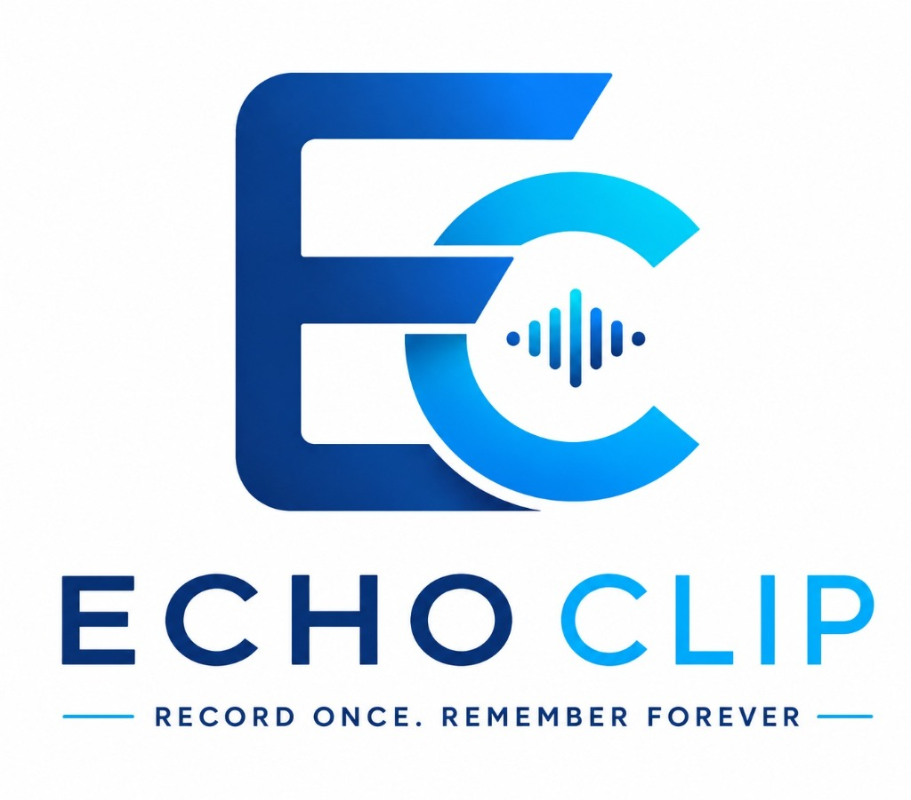

<div align="center" style="border-bottom: none">
    <h1>
        
        <br>
        EchoClip — Privacy-First AI Voice Recorder & Smart Meeting Assistant
    </h1>
    <br>
    <a href="https://github.com/GurunadaRao/Cogni-AI"></a>
    <a href="https://github.com/GurunadaRao/Cogni-AI"></a>
    <a href="https://github.com/GurunadaRao/Cogni-AI"></a>
    <a href="https://github.com/GurunadaRao/Cogni-AI"></a>
    <br>
    <h3>
    <br>
    Record Once. Remember Forever.
    <br>
    Clean Architecture • Real-Time STT • Local & Cloud AI Summaries
    </h3>
    <br>
    <p align="center">
    A privacy-focused, cross-platform AI voice recorder app that captures, transcribes, and summarizes recordings and meetings seamlessly on your device. Powered by Flutter, Riverpod, Google Gemini, and ElevenLabs Scribe STT.
    </p>

</div>

---

<details>
<summary>Table of Contents</summary>

- [Introduction](#introduction)
- [Why EchoClip?](#why-echoclip)
- [Key Features](#key-features)
- [Installation & Getting Started](#installation--getting-started)
- [System Architecture](#system-architecture)
- [Tech Stack & Dependencies](#tech-stack--dependencies)
- [For Developers](#for-developers)
- [License](#license)

</details>

## Introduction

**EchoClip** (*"Record Once. Remember Forever."*) is a modern, high-performance voice recorder and AI-powered meeting assistant built with Flutter. It captures high-fidelity audio, processes real-time speech-to-text transcriptions, and generates actionable AI insights, summaries, and action items without compromising user privacy.

Whether you are in a meeting, interview, or lecture, EchoClip ensures your voice notes are structured, searchable, and stored securely.

---

## Why EchoClip?

- **Privacy-First & Secure:** Offline telemetry options, local storage, and granular control over AI processing endpoints.
- **Real-Time Transcription:** Instant speech-to-text conversion with high precision.
- **AI-Powered Summarization:** Automatically extract executive summaries, bullet points, key takeaways, and action items using Gemini AI models.
- **Cross-Platform:** Runs smoothly on Android, iOS, Web, Windows, macOS, and Linux.
- **IoT & Device Integration:** Seamless companion app support for IoT hardware recording actuators and peripheral device health telemetry.

---

## Key Features

- 🎙️ **Smart Recording:** One-tap high-definition voice recording with real-time waveform visuals.
- ⚡ **Real-Time Speech-To-Text (STT):** Live audio transcription powered by ElevenLabs Scribe / Whisper integration.
- 🤖 **AI Summaries & Insights:** Automated session summaries, key decisions, sentiment tags, and next steps generated by Google Gemini.
- 📁 **Structured History & Search:** Categorized recording archives with instant full-text search across transcripts.
- ⚙️ **Device Control & Telemetry:** Remote IoT actuator triggering, hardware diagnostics, and server port controls.
- 🎨 **Modern Glassmorphic UI:** Crafted using Google Fonts (Outfit & Inter), smooth dark/light themes, and responsive design.

---

## Installation & Getting Started

### Prerequisites
- [Flutter SDK](https://docs.flutter.dev/get-started/install) (`^3.7.0` or higher)
- Dart SDK
- Android Studio / VS Code with Flutter extension

### Quick Start

1. **Clone the repository:**
   ```bash
   git clone https://github.com/GurunadaRao/Cogni-AI.git
   cd ai_voice_recorder
   ```

2. **Install dependencies:**
   ```bash
   flutter pub get
   ```

3. **Run the app:**
   ```bash
   # Run on connected device or emulator
   flutter run
   ```

4. **Build for Production:**
   ```bash
   # Android APK
   flutter build apk --release

   # Web App
   flutter build web --release
   ```

---

## System Architecture

EchoClip follows **Clean Architecture** principles combined with state management via **Riverpod**:

```
lib/
 ├── core/
 │    ├── constants/       # AppColors, Theme tokens
 │    ├── providers/       # Riverpod providers
 │    └── theme/           # AppTheme configuration
 ├── features/
 │    ├── dashboard/       # Main navigation & hub
 │    ├── recorder/        # Recording engine & AI STT
 │    ├── recording/       # Active recording & summary views
 │    ├── history/         # Saved recordings & transcripts
 │    ├── device_config/   # Device settings & setup
 │    ├── device_control/  # Actuators & telemetry
 │    ├── settings/        # System configuration & mock toggle
 │    ├── splash/          # Animated splash screen
 │    └── onboarding/      # Welcome flow
 └── main.dart             # Application entrypoint
```

---

## Tech Stack & Dependencies

- **Framework:** Flutter / Dart
- **State Management:** `flutter_riverpod` (^2.6.1)
- **Typography:** `google_fonts` (^6.2.1)
- **HTTP & Networking:** `http` (^1.6.0), `web_socket_channel` (^3.0.3)
- **Storage & State:** `shared_preferences` (^2.3.3), `path_provider` (^2.1.5)
- **AI Models & STT:** Google Gemini, ElevenLabs Scribe

---

## For Developers

Contributions are welcome! If you want to build upon EchoClip or contribute new features:

1. Fork the repository
2. Create your feature branch (`git checkout -b feature/AmazingFeature`)
3. Run code analysis: `flutter analyze`
4. Commit your changes (`git commit -m 'Add some AmazingFeature'`)
5. Push to the branch (`git push origin feature/AmazingFeature`)
6. Open a Pull Request

---

## License

Distributed under the MIT License. See `LICENSE` for more information.

---

<div align="center">
  <sub>Built with ❤️ using Flutter & AI. EchoClip — Record Once. Remember Forever.</sub>
</div>
